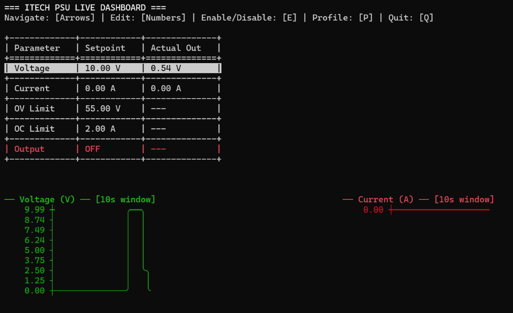
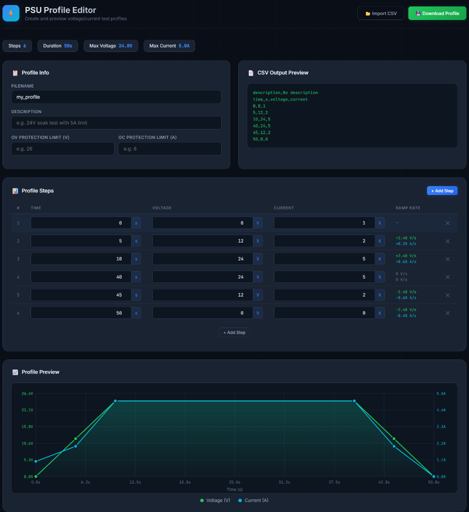
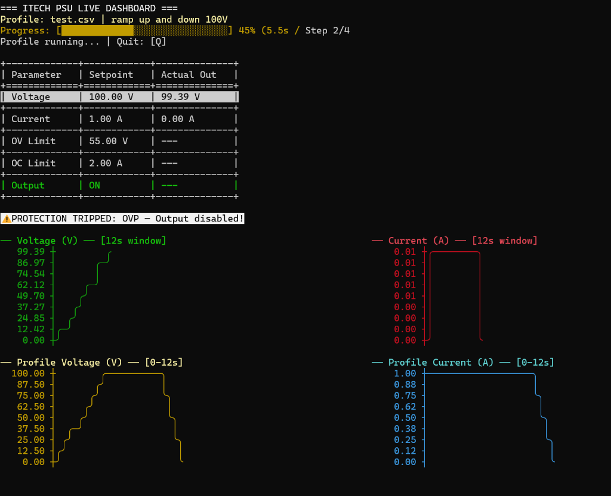

# ITECH PSU Python Driver & TUI

A terminal application for remotely controlling ITECH Programmable Power Supplies over USB. Provides a real-time interactive dashboard and one-shot CLI commands.

## Setup

### Quick Setup (Recommended)
Run the setup script to create a virtual environment, install dependencies, and generate a launcher script.

**Windows (PowerShell):**
```powershell
setup.bat
```

**Linux / macOS / WSL:**
```bash
chmod +x setup.sh
./setup.sh
```

> **WSL Users:** You must attach the PSU to WSL via `usbipd` before running:
> ```powershell
> # In PowerShell (Admin)
> usbipd list                          # Find the PSU bus ID
> usbipd attach --wsl --busid <BUS_ID>
> ```

### Registering a New PSU
Before first use, register the physical safety limits of your power supply. This is a one-time interactive process.
```bash
python3 register_psu.py
```
You will be prompted for the model name, max voltage, max current, and max power ratings. These limits are stored in `psu_registry.json` and enforced at runtime to prevent exceeding hardware capabilities.

---

## Interactive Dashboard

Launch the live TUI dashboard to control the PSU like a front panel:

```bash
./run.sh --live       # Linux / WSL
run.bat --live        # Windows
```



**Controls:**
| Key | Action |
|:---|:---|
| **↑ / ↓** | Navigate parameter fields (Voltage, Current, OV Limit, OC Limit) |
| **0-9 / .** | Enter edit mode and type a new setpoint value |
| **Enter** | Submit the edited value to the PSU |
| **E** | Toggle output ON / OFF |
| **ESC** | Cancel current edit |
| **Q** | Safely power down and exit |

---

## CLI Commands

Execute one-off commands without launching the dashboard.

| Flag | Arguments | Description |
|:---|:---|:---|
| `-s`, `--set` | `VOLTS AMPS` | Set voltage and current setpoints |
| `-p`, `--protect` | `OV OC` | Set overvoltage and overcurrent protection limits |
| `-e`, `--enable` | `0` or `1` | Disable or enable the output |
| `-m`, `--measure` | — | Print voltage, current, and power telemetry |
| `--errors` | — | Sweep the hardware error queue |
| `--live` | — | Launch the interactive TUI dashboard |
| `--device` | `VISA_STRING` | Target a specific PSU when multiple are connected |

**Examples:**
```bash
# Set 24V / 5A and enable output
./run.sh --set 24 5 --enable 1

# Read live telemetry
./run.sh --measure

# Set protection limits (26V OVP, 5.5A OCP)
./run.sh -p 26 5.5

# Check for hardware errors
./run.sh --errors

# Target a specific PSU by VISA resource string
./run.sh --device "USB0::0x2EC7::0x6900::800776011807210025::INSTR" --measure
```

---

## Profile System

Profiles are CSV files that define automated voltage/current test sequences. The PSU will linearly interpolate between steps, creating smooth ramps.

### CSV Format

```csv
description,24V Soak Test - Ramp up hold 24V for 30s then ramp down
ov_limit,26
oc_limit,6
time_s,voltage,current
0,0,1
2,12,2
5,24,5
35,24,5
37,12,2
40,0,0
```

| Field | Required | Description |
|:---|:---|:---|
| `description` | Yes | First row — text description displayed in the profile picker |
| `ov_limit` | No | Over-Voltage Protection trip point (V). PSU shuts off if exceeded |
| `oc_limit` | No | Over-Current Protection trip point (A). PSU shuts off if exceeded |
| `time_s` | Yes | Header row marking the start of step data |
| Data rows | Yes | `time_s,voltage,current` — one row per setpoint |

> **Note:** The PSU linearly interpolates between steps. To hold a constant value, add two steps at the same voltage/current with different timestamps (see the 5s→35s hold in the example above).

### Profile Editor (GUI)

Open `profile_editor.html` in your browser to visually create and edit profiles:

- **Interactive step table** — add, remove, and edit timestamped setpoints
- **Live chart preview** — dual-axis voltage/current graph with interpolation
- **Ramp rate display** — auto-calculated V/s and A/s between steps
- **OV/OC protection fields** — set safety limits for the profile
- **CSV preview** — live-updating raw output
- **Import/Export** — load existing profiles or save new ones to `profiles/`



### Loading a Profile

#### From the Dashboard (recommended)

1. **Launch the dashboard**
   ```bash
   ./run.sh --live       # Linux / WSL
   run.bat --live        # Windows
   ```

2. **Press `P`** to open the profile picker. All `.csv` files in the `profiles/` directory are listed with their descriptions:
   ```
   === SELECT PROFILE ===
   Use [↑/↓] to navigate, [Enter] to select, [ESC] to cancel

     example_24v_soak.csv        24V Soak Test - Ramp up hold 24V for 30s then ramp down
     example_voltage_sweep.csv   Voltage sweep from 0V to 50V
   ```

3. **Use ↑/↓ to select**, then press **Enter** to load. The dashboard switches to profile mode with a 2×2 chart layout showing a preview of the profile.

4. **Press `T` to trigger** the profile. The PSU will:
   - Set OV/OC protection limits (if defined in the CSV)
   - Enable the output
   - Begin ramping through each step with linear interpolation

5. **While running**, the top charts show live telemetry and the bottom charts show the profile preview. A progress bar shows elapsed time, percentage, and current step.



6. **When complete**, the PSU holds the last step values. Press `P` to load another profile or `Q` to disable output and exit.

| Key | Action |
|:---|:---|
| **P** | Open profile picker (from normal or profile mode) |
| **T** | Trigger the loaded profile |
| **Q** | Safely disable output and exit |
| **ESC** | Return to normal dashboard mode (in profile picker) |

#### From the Command Line

```bash
# Run a profile with the live dashboard
./run.sh --live --profile profiles/example_24v_soak.csv

# Run a profile in headless CLI mode (prints progress to stdout)
./run.sh --profile profiles/example_24v_soak.csv
```

### Dashboard Behavior in Profile Mode

When a profile is loaded, the dashboard switches to a **2×2 chart layout**:

| Position | Chart |
|:---|:---|
| Top-left | **Live Voltage** — real-time measured output |
| Top-right | **Live Current** — real-time measured output |
| Bottom-left | **Profile Voltage** — preview of the full voltage profile |
| Bottom-right | **Profile Current** — preview of the full current profile |

The live chart time window automatically matches the profile duration (e.g., a 40s profile shows a 40s window instead of the default 10s).

### Protection Trips

If the PSU hits an OV or OC limit during a profile (or at any time), the dashboard displays:

```
⚠ PROTECTION TRIPPED: OVP — Output disabled!
```

The output status will show **TRIP** and the PSU output is automatically shut off by the hardware.

### Creating Profiles

1. **GUI:** Open `profile_editor.html` → design your profile → click **Download Profile** → save to `profiles/`
2. **Manual:** Create a CSV file in `profiles/` following the format above

All `.csv` files in the `profiles/` directory are automatically discovered by the profile picker.

---

## Developer Reference

For driver API documentation and code integration examples, see [DEVELOPER.md](DEVELOPER.md).
